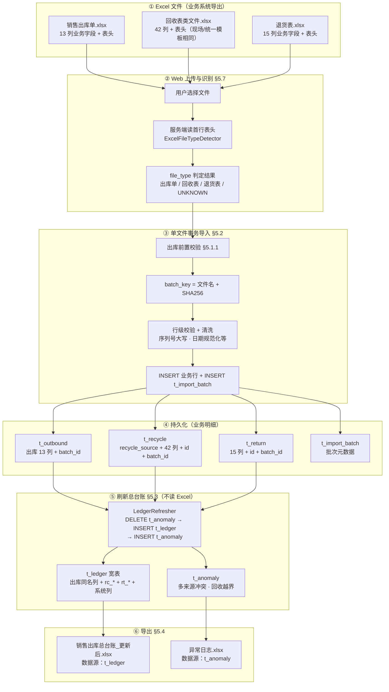
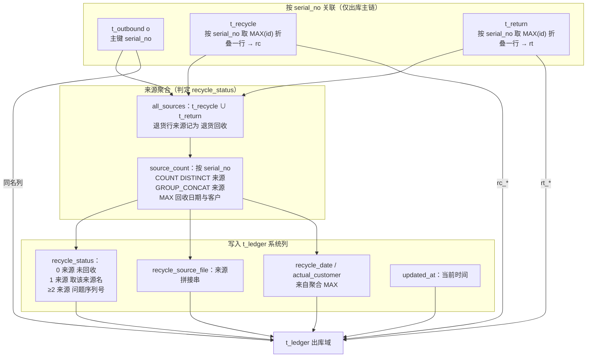
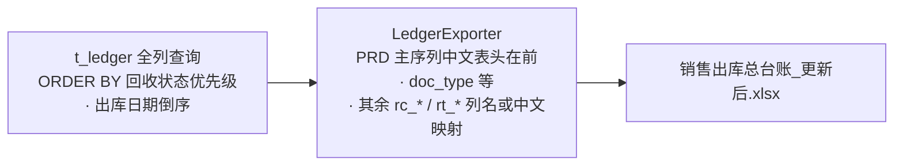

# 财务回收对账系统 PRD（SQLite主存储，最终版）

---

## 1. 背景与目标

### 1.1 业务现状

公司开业以来的所有出库序列号均保存在销售出库单中，当前总量已达 **80w+ 条**，且每月末持续增量。每月底财务需手工核对 **四类** 数据：**增量销售出库单**（与当月/当期出库明细对应）以及 **现场回收、统一回收、退货表** 三类回收明细；工作量大、易出错、无历史追溯。

### 1.2 产品目标

- 将月底核对从"4份Excel人工比对"变为"一键导入 + 自动处理 + 按需导出"。
- 建立以 SQLite 为核心的本地数据资产，取代分散的Excel文件流转。
- 为后续多维分析（医院/销售/时间）预留数据基础。

### 1.3 已确认决策

| 决策项 | 选择 | 说明 |
|--------|------|------|
| 存储模式 | SQLite主存储 | Excel仅作为进出口介质 |
| 改库权限 | 仅增量导入 | 不提供手工增删改，降低误操作风险 |
| 导出策略 | 自动尾缀另存为 | 不覆盖历史导出，自动追加 `(1)` `(2)` |

---

## 2. 用户与使用场景

### 2.1 目标用户

- 财务人员，不会编程，熟悉Excel操作。
- 每月操作频率：1次（月底批处理）。

### 2.2 核心使用场景

> 每月底，财务从业务系统导出 **销售出库单、现场回收、统一回收、退货表** 等 Excel，在浏览器中打开本系统，进入 **「数据导入」** Tab，按需上传一个或多个文件，点击 **「开始导入」**；完成后切换到 **「数据看板」** 查看统计与明细，必要时点击 **「刷新总台账」** 统一重算结果，再导出总台账或异常日志交由相关人员使用。**不强制** 单次必须四类文件齐全（见 §5.7）。

---

## 3. 数据字典

> 下列 **业务明细表**（`t_outbound`、`t_recycle`、`t_return`）中，除系统追加字段外，**列语义与业务导出 Excel 保持一致**；经 §5.2 清洗规则转换后的单元格值视为与源表 **一致**（日期格式统一、序列号大写等）。完整 SQL 与 42 列回收全量映射见 [TECH_DESIGN.md](./TECH_DESIGN.md)。

### 3.0 数据流动总览（字段级）

本节用 **流程图 + 对照表** 描述从 **Excel 首行表头与单元格** 到 **SQLite 各表字段** 再到 **总台账 / 异常 / 导出** 的全链路；与 §5.2、§5.3、§5.4、§5.7 及实现（`FileImporter`、`LedgerRefresher`、`sql/refresh_ledger.sql`、`LedgerExporter`）一致。

#### 3.0.1 端到端主流程（大图）



#### 3.0.2 导入阶段数据流：Excel 列 → 中间处理 → 库表字段

```mermaid
flowchart TB
  subgraph x_out["销售出库单.xlsx → t_outbound"]
    direction LR
    XO1["Excel 列：序列号…描述（13）"] --> XO2["按列名键入 Map"]
    XO2 --> XO3["DataCleaner.cleanRow<br/>日期 · 序列号大写"]
    XO3 --> XO4["INSERT 列：serial_no … description"]
    XO4 --> XO5["batch_id ← 当前批次 id"]
  end

  subgraph x_rc["回收表.xlsx → t_recycle"]
    direction LR
    XR1["Excel 列：42 标准列名"] --> XR2["parseRow 按表头顺序"]
    XR2 --> XR3["DataCleaner + 运单号合并规则"]
    XR3 --> XR4["resolveRecycleSourceFromRow<br/>「回收方式」文本含 统一/现场"]
    XR4 --> XR5["recycle_source + INSERT 42 业务列"]
    XR5 --> XR6["batch_id ← 当前批次 id"]
  end

  subgraph x_rt["退货表.xlsx → t_return"]
    direction LR
    XT1["Excel 列：15 标准列名"] --> XT2["parseRow + cleanRow"]
    XT2 --> XT3["INSERT 15 业务列"]
    XT3 --> XT4["batch_id ← 当前批次 id"]
  end
```



**说明：** `t_import_batch` 与业务表同一事务写入：先写入批次记录取得 `id`，再将 `batch_id` 写入各业务行（外键追溯）。

#### 3.0.2b 批次表 `t_import_batch`：字段来源（非 Excel 列，与文件绑定）

| 字段 | 含义 | 数据来源 |
|------|------|----------|
| `id` | 批次主键 | SQLite 自增 |
| `batch_key` | 幂等唯一键 | `原始文件名 + "::" + SHA256(文件内容)` |
| `file_name` | 展示用文件名 | 上传时的原始文件名 |
| `file_type` | 与识别结果一致 | `出库单` / `回收表` / `退货表` |
| `imported_at` | 导入完成时间 | 服务端当前时间字符串 |
| `total_rows` / `new_rows` / `skip_rows` / `anomaly_rows` | 本文件统计 | 导入管线在提交前汇总 |

业务表中的 `batch_id` / `outbound_batch_id` / `rc_batch_id` / `rt_batch_id` 均指向本次成功导入对应的 `t_import_batch.id`。

#### 3.0.3 销售出库单：Excel 列名 → `t_outbound` 字段 → `t_ledger` 字段

| # | Excel 列名（首行） | `t_outbound` | `t_ledger`（物化宽表，出库域同名列） |
|---|-------------------|--------------|-------------------------------------|
| 1 | 序列号 | serial_no | serial_no（主键） |
| 2 | 物料编码 | material_code | material_code |
| 3 | 物料名称 | material_name | material_name |
| 4 | 规格型号 | spec | spec |
| 5 | 日期 | outbound_date | outbound_date |
| 6 | 单据编号 | doc_no | doc_no |
| 7 | 订单单号 | order_no | order_no |
| 8 | 销售员 | salesperson | salesperson |
| 9 | 销售部门 | sales_dept | sales_dept |
| 10 | 客户 | customer | customer |
| 11 | 终端客户 | end_customer | end_customer |
| 12 | 单据类型 | doc_type | doc_type |
| 13 | 描述 | description | description |
| — | （系统，非 Excel 列） | batch_id | outbound_batch_id |

#### 3.0.4 回收表：Excel 列名 → `t_recycle` 字段 → `t_ledger` 字段（`rc_` 前缀）

| # | Excel 列名 | `t_recycle` | `t_ledger` |
|---|-----------|-------------|------------|
| — | （导入时由「回收方式」解析，非单独 Excel 列名） | recycle_source | rc_recycle_source |
| — | （系统） | id | rc_id |
| 1 | 序列号 | serial_no | rc_serial_no |
| 2 | 状态 | status | rc_status |
| 3 | 剩余发数 | remaining_count | rc_remaining_count |
| 4 | 实际回收客户 | actual_customer | rc_actual_customer |
| 5 | 现场实际回收日期 | onsite_recycle_date | rc_onsite_recycle_date |
| 6 | 现场实际回收运单号 | onsite_waybill_no | rc_onsite_waybill_no |
| 7 | 单据编码（必填） | doc_code | rc_doc_code |
| 8 | 规格型号 | spec | rc_spec |
| 9 | 回收方式 | recycle_method | rc_recycle_method |
| 10 | 扫码回收（必填） | scan_recycle_code | rc_scan_recycle_code |
| 11 | 折扣订单指令号 | discount_order_no | rc_discount_order_no |
| 12 | 扫码 | scan_code | rc_scan_code |
| 13 | 运单单号 | waybill_no | rc_waybill_no |
| 14 | 产品编码 | product_code | rc_product_code |
| 15 | ERP指令号 | erp_order_no | rc_erp_order_no |
| 16 | 终端医院 | terminal_hospital | rc_terminal_hospital |
| 17 | 客户名称 | customer_name | rc_customer_name |
| 18 | 实际回收终端 | actual_terminal | rc_actual_terminal |
| 19 | 描述 | description | rc_description |
| 20 | 回收序列号 | recycle_serial_no | rc_recycle_serial_no |
| 21 | 产品名称 | product_name | rc_product_name |
| 22 | 销售订单 | sales_order | rc_sales_order |
| 23 | 销售出库单 | sales_outbound_doc | rc_sales_outbound_doc |
| 24 | 锁定状态 | lock_status | rc_lock_status |
| 25 | 回收日期 | recycle_date | rc_recycle_date |
| 26 | 出库日期 | outbound_date | rc_outbound_date |
| 27 | ERP出库单号 | erp_outbound_no | rc_erp_outbound_no |
| 28 | 创建人 | created_by | rc_created_by |
| 29 | 创建时间 | created_at | rc_created_at |
| 30 | 业务类型 | biz_type | rc_biz_type |
| 31 | 归属部门 | dept | rc_dept |
| 32 | 负责人主属部门 | owner_dept | rc_owner_dept |
| 33 | 负责人（必填） | owner | rc_owner |
| 34 | 生命状态 | life_status | rc_life_status |
| 35 | 销售经理 | sales_manager | rc_sales_manager |
| 36 | 来源 | source | rc_source |
| 37 | 最后修改人 | last_modified_by | rc_last_modified_by |
| 38 | 最后修改时间 | last_modified_at | rc_last_modified_at |
| 39 | 版本 | version | rc_version |
| 40 | 所属集团 | group_name | rc_group_name |
| 41 | 下单日期 | order_date | rc_order_date |
| 42 | 终端机构 | terminal_org | rc_terminal_org |
| — | （系统） | batch_id | rc_batch_id |

#### 3.0.5 退货表：Excel 列名 → `t_return` 字段 → `t_ledger` 字段（`rt_` 前缀）

| # | Excel 列名 | `t_return` | `t_ledger` |
|---|-----------|------------|------------|
| — | （系统） | id | rt_id |
| 1 | 类别 | category | rt_category |
| 2 | 库存方向 | stock_direction | rt_stock_direction |
| 3 | 序列号 | serial_no | rt_serial_no |
| 4 | 物料编码 | material_code | rt_material_code |
| 5 | 物料名称 | material_name | rt_material_name |
| 6 | 规格型号 | spec | rt_spec |
| 7 | 日期 | return_date | rt_return_date |
| 8 | 单据编号 | doc_no | rt_doc_no |
| 9 | 指令号 | order_no | rt_order_no |
| 10 | 领料人 | handler | rt_handler |
| 11 | 领料部门 | dept | rt_dept |
| 12 | 客户 | customer | rt_customer |
| 13 | 终端客户 | end_customer | rt_end_customer |
| 14 | 其他出库类型 | return_reason | rt_return_reason |
| 15 | 收货地址 | shipping_address | rt_shipping_address |
| — | （系统） | batch_id | rt_batch_id |

#### 3.0.6 刷新阶段：`t_outbound` + `t_recycle` + `t_return` → `t_ledger` 系统列与折叠



**说明：** 越界序列号（仅存在于 `t_recycle`/`t_return` 且无出库）**不写入** `t_ledger`，见 §5.3 与 §3.0.7。

#### 3.0.7 刷新阶段：异常写入 `t_anomaly`（字段含义）

| 数据含义 | 来源 | 写入字段 |
|---------|------|----------|
| 问题序列号 | 同一 `serial_no` 在多种回收来源同时存在 | `serial_no`、`anomaly_type`=多来源冲突、`detail`/`source_files` 描述来源组合 |
| 回收越界 | `t_recycle` 或 `t_return` 中有序列号，但 `t_outbound` 无 | `serial_no`、`anomaly_type`=回收越界、`detail` 说明来自哪张业务表 |

**不经过 Excel 列映射**：`t_anomaly` 仅由刷新 SQL 生成，与导入文件列无直接一一对应。

#### 3.0.8 导出阶段：`t_ledger` → Excel 文件（列顺序）



**与 §5.4 一致：** 导出前段列为 PRD 规定的业务主序列（序列号…最后更新时间），其后为 `doc_type`、`description`、`outbound_batch_id` 及全部 `rc_*`、`rt_*` 分析字段；**不**回写原始 Excel 文件路径，仅生成新文件至 `output/`（命名带尾缀策略见 §5.4）。

---

### 3.1 销售出库单 → 数据库表 `t_outbound`

| Excel 列名 | 数据库表.字段 | 类型/约束 | 说明与示例 | **数据刷新（生成 `t_ledger`）** |
|------------|--------------|-----------|------------|--------------------------------|
| 序列号 | `t_outbound.serial_no` | TEXT PK | US45CS5BGG288 | **使用**：作为台账主键；与回收表按序列号关联；无回收命中时对应 `recycle_status='未回收'` |
| 物料编码 | `t_outbound.material_code` | TEXT | P020400286 | **使用**：写入 `t_ledger.material_code` |
| 物料名称 | `t_outbound.material_name` | TEXT | 点式治疗头 | **使用**：写入 `t_ledger.material_name` |
| 规格型号 | `t_outbound.spec` | TEXT | D4.5 | **使用**：写入 `t_ledger.spec` |
| 日期 | `t_outbound.outbound_date` | TEXT | 出库日期，规范为 YYYY-MM-DD | **使用**：写入 `t_ledger.outbound_date` |
| 单据编号 | `t_outbound.doc_no` | TEXT | XSCK… | **使用**：写入 `t_ledger.doc_no` |
| 订单单号 | `t_outbound.order_no` | TEXT | XSDD… | **使用**：写入 `t_ledger.order_no` |
| 销售员 | `t_outbound.salesperson` | TEXT | 张三 | **使用**：写入 `t_ledger.salesperson` |
| 销售部门 | `t_outbound.sales_dept` | TEXT | 西北区 | **使用**：写入 `t_ledger.sales_dept` |
| 客户 | `t_outbound.customer` | TEXT | 经销商 | **使用**：写入 `t_ledger.customer` |
| 终端客户 | `t_outbound.end_customer` | TEXT | 终端 | **使用**：写入 `t_ledger.end_customer` |
| 单据类型 | `t_outbound.doc_type` | TEXT | 标准销售出库单 | **使用**：物化至 `t_ledger.doc_type` |
| 描述 | `t_outbound.description` | TEXT | 附加描述 | **使用**：物化至 `t_ledger.description` |
| （系统） | `t_outbound.batch_id` | INTEGER FK | 关联 `t_import_batch.id` | **使用**：物化至 `t_ledger.outbound_batch_id`（追溯） |

### 3.2 现场回收 / 统一回收 → 数据库表 `t_recycle`

与 Excel **42 列** 一一对应（列名同导出模板），另增：

| 系统字段 | 含义 | **数据刷新中的使用** |
|----------|------|---------------------|
| `t_recycle.id` | 自增主键 | 物化至 `t_ledger.rc_id`（折叠多行时取 `MAX(id)` 所在行，见 TECH_DESIGN） |
| `t_recycle.recycle_source` | `现场回收` / `统一回收` | **使用**：区分回收来源；与 `serial_no` 一起参与多来源判定、`recycle_status` 赋值 |
| `t_recycle.batch_id` | 导入批次 | 追溯 |

**刷新强相关列（Excel 列名 → 字段）**（其余列原样落库，刷新逻辑以序列号聚合为主，明细展示见 TECH_DESIGN）：

| Excel 列名 | `t_recycle` 字段 | **数据刷新** |
|------------|-----------------|-------------|
| 序列号 | `serial_no` | 与 `t_outbound` 关联；多行同序列号参与「多来源」判定 |
| 回收日期 | `recycle_date` | 写入台账 `recycle_date`（择优规则与实现一致，见 TECH_DESIGN） |
| 实际回收客户 | `actual_customer` | 可写入台账 `actual_customer` |
| 现场实际回收运单号 / 运单单号 | `onsite_waybill_no` / `waybill_no` | 业务备查；是否进台账由实现定义 |

其余 38 列与 [TECH_DESIGN.md](./TECH_DESIGN.md) §3.2 映射表一致，**导入后库内值与 Excel 一致**（经清洗规则后）。

### 3.3 退货表 → 数据库表 `t_return`

| Excel 列名 | `t_return` 字段 | **数据刷新（生成 `t_ledger`）** |
|------------|----------------|--------------------------------|
| 类别 | `category` | 备查 |
| 库存方向 | `stock_direction` | 备查 |
| 序列号 | `serial_no` | **使用**：与出库关联；作为退货回收来源参与来源集合 |
| 物料编码 | `material_code` | 备查 |
| 物料名称 | `material_name` | 备查 |
| 规格型号 | `spec` | 备查 |
| 日期 | `return_date` | **使用**：可作为台账退货场景下的回收日期来源 |
| 单据编号 | `doc_no` | 备查 |
| 指令号 | `order_no` | 备查 |
| 领料人 | `handler` | 备查 |
| 领料部门 | `dept` | 备查 |
| 客户 | `customer` | 备查 |
| 终端客户 | `end_customer` | 备查 |
| 其他出库类型 | `return_reason` | 备查 |
| 收货地址 | `shipping_address` | 备查 |
| （系统） | `id`, `batch_id` | 追溯 |

### 3.4 物化表与日志表（非 Excel 直接导入）

| 表名 | 主要字段（节选） | **数据刷新环节** |
|------|-----------------|----------------|
| `t_ledger` | **宽表**：出库字段（与 `t_outbound` 列名一致，含 `doc_type`、`description`、`outbound_batch_id`）+ 系统状态列 + **全部** `rc_*`（来自 `t_recycle`）+ **全部** `rt_*`（来自 `t_return`），详见 [TECH_DESIGN.md §3.4](./TECH_DESIGN.md) | **输出表**：每次 **刷新总台账** 时由三表 **全量重算** 覆盖写入；同一序列号在多行回收/退货明细时 **按 `MAX(id)` 折叠为一行** 再 JOIN |
| `t_import_batch` | `id`，`batch_key`，`file_name`，`file_type`，`imported_at`，`total_rows`… | **不参与** 刷新计算；记录导入批次与幂等 |
| `t_anomaly` | `id`，`serial_no`，`anomaly_type`，`detail`，`source_files`，`batch_id`，`created_at` | **写入**：刷新阶段写入 `多来源冲突`、`回收越界` 等；导入阶段在 §5.2 **整文件事务** 下若失败则 **不写** 该文件对应业务行，**可不写** `t_anomaly`（以界面错误提示为准） |

### 3.5 回收状态枚举（`t_ledger.recycle_status`）

| 状态值 | 触发条件 |
|--------|---------|
| `未回收` | 序列号在 `t_outbound` 中，且不在任一回收业务表命中 |
| `现场回收` | 序列号仅在 `t_recycle` 且 `recycle_source='现场回收'` 命中（恰好一类回收来源） |
| `统一回收` | 序列号仅在 `t_recycle` 且 `recycle_source='统一回收'` 命中 |
| `退货回收` | 序列号仅在 `t_return` 命中 |
| `问题序列号` | 序列号在 **两个及以上** 回收来源组合中出现 |

### 3.6 异常类型与存储（业务名 ↔ `t_anomaly.anomaly_type` / exception）

库表 `t_anomaly.anomaly_type` 存 **英文枚举码**（实现与下列 **exception** 一致）；界面与导出可用中文说明。

| 业务异常名 | **exception / `anomaly_type` 建议取值** | 触发阶段 | 写入 `t_anomaly` | 说明 |
|------------|------------------------------------------|----------|------------------|------|
| 多来源冲突 | `MULTI_SOURCE_CONFLICT`（存库可用中文 `多来源冲突`，以实现为准但 **全库统一一种写法**） | **仅刷新** | 是 | 同一 `serial_no` 在多种回收来源同时存在 |
| 回收越界 | `RECYCLE_OUT_OF_BOUND` | **仅刷新** | 是 | `t_recycle` / `t_return` 中序列号不在 `t_outbound` |
| 文件内重复 | `DUPLICATE_IN_FILE` | **导入校验** | 否（§5.2：整文件回滚） | 同一文件内序列号重复 → **中止本文件并回滚** |
| 必填列缺失 | `REQUIRED_FIELD_MISSING` | **导入校验** | 否（§5.2：整文件回滚） | 缺「序列号」列或某行序列号为空 → **中止本文件并回滚** |

> **说明**：导入阶段不再采用「跳过坏行、其余入库」；坏行一旦命中规则，**整文件回滚**。`t_anomaly` 主要承载 **刷新阶段** 的规则型异常（多来源、越界等）。

---

## 4. 数据库表概览

| 表名 | 用途 |
|------|------|
| `t_outbound` | 销售出库主表（全量历史） |
| `t_recycle` | 现场回收 + 统一回收明细（`recycle_source` 字段区分） |
| `t_return` | 退货回收明细 |
| `t_ledger` | 总台账物化结果（刷新总台账时全量重算） |
| `t_import_batch` | 导入批次日志 |
| `t_anomaly` | 异常记录（以刷新阶段写入为主，见 §3.6） |

**与 Excel 一致性（业务三表）：** `t_outbound`、`t_recycle`、`t_return` **必须与** 各自对应导入文件在 **列语义与数据内容** 上保持一致：除系统追加字段（`batch_id`，以及 `t_recycle` 的 `id`、`recycle_source`）外，业务列与导出模板 **一一对应**；经 §5.2 **统一清洗规则**（日期格式、序列号大写等）后的存库值视为与源 Excel **一致**。不得在导入时静默丢弃列或改写业务含义。

> 完整字段定义、SQL 建表语句及索引清单见 [TECH_DESIGN.md](./TECH_DESIGN.md)。

---

## 5. 功能需求

### 5.1 数据库初始化

- 首次启动自动建库建表，无需用户操作。
- 数据库文件保存路径：`./data/recycle.db`（与程序同目录）。
- 启动时检测结构版本，如有变更自动执行迁移脚本。

#### 5.1.1 库文件生命周期与导入前置条件（出库为基石）

**手工删除 / 替换 / 移动 `recycle.db` 时的连接约定**

- 若在 **Web 服务已启动** 的情况下删除、移动或覆盖数据库文件，底层 SQLite 连接可能仍指向旧文件，写入时会出现「只读 / 文件已迁移」类错误（实现层表现为 `SQLITE_READONLY_DBMOVED` 等）。
- **推荐操作**：替换或清空库文件后 **重启本应用**，再执行导入。
- **实现要求**：检测到上述错误时，应 **自动重置连接池并重新执行建表脚本**（与首次启动等价），并 **对当前导入请求重试一次**，避免用户仅因未重启而无法继续；若重试仍失败，界面提示用户检查库文件或重启应用。

**导入顺序与「出库主数据」前置条件**

- **销售出库单（`t_outbound`）是后续对账与总台账的基石**：总台账以出库序列号为主干叠加回收状态（见 §3.4、§5.3），统计看板中「总出库数」等口径亦依赖 `t_outbound`。
- **当 `t_outbound` 中尚无任何出库记录时**（含：`recycle.db` 尚不存在、空库刚完成建表、或用户清空出库表后），**仅允许**导入 **销售出库单**（服务端 `file_type`：`出库单`）。**不得**单独导入 **回收表、退货表**；服务端须 **拒绝本次导入** 并业务提示：**须先导入销售出库单建立序列号主数据，再导入回收类与退货类文件**。
- **当 `t_outbound` 中已有至少一条出库记录后**，方可按 §5.2、§5.7 正常增量导入 **回收表、退货表**，并可持续增量导入新的销售出库单。
- Web **数据导入** Tab 宜根据当前库状态提示：尚无出库数据时，提醒用户先上传销售出库单（与接口返回的「是否允许导入回收/退货」一致）。

### 5.2 增量导入（核心功能）

**整体导入流程：**

```
用户选择 Excel 文件
  → 计算文件 SHA256 哈希
  → 检查 `t_import_batch.batch_key` 是否已存在（幂等）
    → 已存在：跳过并提示「此文件已导入过数据库」
    → 不存在：校验 §5.1.1 **出库前置条件**（若为回收/退货类且 `t_outbound` 为空则拒绝）
        → 开启 **单文件数据库事务**
        → 表头与类型校验（与 §5.7 一致）
        → 逐行字段校验 + 数据清洗
        → 若 **任一行** 不符合规则：**回滚本文件全部写入**，终止该文件导入并业务提示
        → 否则提交事务，写入 `t_import_batch` 及业务表
  → （可选）全量刷新总台账 §5.3
  → 展示本次导入统计
```

**单文件 = 单次事务（强约束）：**

- **一个 Excel 文件** 的导入必须在 **一个数据库事务** 内完成：**全部成功则提交**；若在读取过程中发现 **任意一行** 不符合校验或清洗后仍非法（含序列号空、文件内重复序列号、缺列等），则 **立即中止、整文件回滚**，**不** 向 `t_outbound` / `t_recycle` / `t_return` 留下该文件的任何行，也 **不** 写入该文件对应的 `t_import_batch` 成功记录（或标记为失败，以实现为准）。
- 允许在实现上使用 **流式 / 分块读取** 仅用于控制内存，但 **不得在中间状态提交**；对用户语义仍为「整文件全有或全无」。

**字段校验规则（任一行失败 → 整文件失败）：**

- 文件级：必须包含 **「序列号」** 列，否则本文件失败并提示。
- 行级：序列号 **去空后** 不得为空；否则本文件失败（对应 §3.6 `REQUIRED_FIELD_MISSING` 场景，界面说明行号）。
- 行级：同一文件内 **序列号不得重复**（清洗后比较）；若重复则本文件失败（对应 §3.6 `DUPLICATE_IN_FILE`）。

**数据清洗规则（在事务内、提交前完成）：**

- 序列号去首尾空格，统一转大写。
- 日期字段兼容 `YYYY/MM/DD` 与 `YYYY-MM-DD`，统一存为 `YYYY-MM-DD`。
- 其它列按 `FileImporter` / TECH_DESIGN 与 Excel 模板一致落库；**不** 在导入阶段做「多来源冲突」「回收越界」判定（该两类仅在 §5.3 刷新时写入 `t_anomaly`）。

**幂等策略：**

- 以 `文件名 + SHA256 哈希` 组合为 `batch_key`，写入 `t_import_batch.batch_key`（UNIQUE）。
- **同一文件**（内容未变，哈希相同）再次导入：直接跳过，界面提示 **「此文件已导入过数据库」**，不产生脏数据。

**性能说明：**

- 大文件可在单事务内 **分块读取** 以降低内存峰值（如每批 5000 行），但 **提交点仅为文件级一次**；若单事务过大导致超时或锁持有过久，须在 TECH_DESIGN 中另行论证优化方案，且不得违背「任一行失败则整文件回滚」的产品语义。

### 5.3 总台账刷新逻辑

**输入与输出：** **刷新** 仅 **读取** 当前库中的 `t_outbound`、`t_recycle`、`t_return`（三表须与已导入 Excel 一致，见 §4），**重算并覆盖写入** `t_ledger`；并在本流程中 **维护** `t_anomaly` 中与本次刷新相关的记录（多来源冲突、回收越界等，见 §3.6）。**不读取** Excel 文件。**每次导入完成后可自动触发** 一次刷新；用户也可通过「刷新总台账」手动触发（§5.7）。

**状态判定（对 `t_outbound` 中每个 `serial_no`）：**

```
  sources = 命中的回收来源集合
    - 若在 t_recycle 中 recycle_source='现场回收' 有记录 → 加入 {现场回收}
    - 若在 t_recycle 中 recycle_source='统一回收' 有记录 → 加入 {统一回收}
    - 若在 t_return 中有记录                          → 加入 {退货回收}

  len(sources) == 0  → recycle_status = '未回收'
  len(sources) == 1  → recycle_status = sources[0]（映射到 §3.5 枚举）
  len(sources) >= 2  → recycle_status = '问题序列号'
        → 写入 t_anomaly：anomaly_type = 多来源冲突（或 MULTI_SOURCE_CONFLICT），见 §3.6

  UPSERT 到 t_ledger（出库维度字段来自 t_outbound，回收维度来自命中的回收明细）
```

**回收越界检测（刷新阶段）：**

- 扫描 `t_recycle`、`t_return` 中 `serial_no` **不在** `t_outbound` 中的记录。
- 写入 `t_anomaly`（`anomaly_type` = 回收越界 / `RECYCLE_OUT_OF_BOUND`）；对应序列号 **不进入** `t_ledger` 主链（或仅通过异常表呈现，以实现与 TECH_DESIGN 为准）。

### 5.4 按需导出

**总台账导出（`销售出库总台账_更新后.xlsx`）：**

- 数据源：`t_ledger` 全量。
- 输出列顺序：**前段** 为 PRD 主序列（序列号、物料编码、物料名称、规格型号、出库日期、单据编号、订单单号、销售员、销售部门、客户、终端客户、**回收状态**、**回收来源**、**回收日期**、**实际回收客户**、最后更新时间），**继以** `doc_type`、`description`、`outbound_batch_id`，**再输出** 其余 `rc_*`、`rt_*` 全部分析字段（表头为中文映射或数据库列名，以实现为准）。
- 排序：`问题序列号` 置顶，其次 `未回收`，其余按出库日期倒序。
- 导出方式：分块5000行写出xlsx，避免内存占用过高。

**异常日志导出（`异常日志.xlsx`）：**

- 数据源：`t_anomaly` 全量。
- 输出列：序列号、异常类型、详细说明、涉及来源文件、批次ID、导入时间。

**文件命名策略：**

- 目标路径存在同名文件时，自动追加递增尾缀：`(1)`、`(2)`……直到不冲突。
- 不弹确认弹窗，不覆盖历史文件。
- 导出完成后展示完整保存路径，并提供"打开所在文件夹"快捷按钮。

### 5.5 统计看板（导入或刷新完成后更新）

**「数据看板」Tab 顶部「全局概览」** 仅展示下列 **四项**（与 `GET /api/statistics` 中 `statistics` 核心字段一致）：

| 指标 | 计算来源 |
|------|---------|
| 总出库数 | `COUNT(*) FROM t_outbound` |
| 已回收数 | `COUNT(*) FROM t_ledger WHERE recycle_status IN ('现场回收','统一回收','退货回收')` |
| 未回收数 | `COUNT(*) FROM t_ledger WHERE recycle_status = '未回收'` |
| 总回收率 | `t_ledger` 中三类已回收行数 / `COUNT(*)`（分母为 0 时按 §6.1 文案规范处理；与实现中 `recycleRate` 一致） |

**说明：** **台账「问题序列号」** 与 **`t_anomaly` 异常明细** 不再占用全局概览卡片；其中 **`t_anomaly` 全量行** 在 **「异常信息」** Tab 分页展示（见 §5.9）。本批次导入摘要等仍可由 `t_import_batch` 支撑，若界面暂不展示可不实现。

| 指标（扩展 / 非全局概览必填） | 计算来源 |
|------|---------|
| 本批次新增出库数 | 来自当次导入 `t_import_batch` 及实现统计 |
| 本批次新增回收数 | 来自当次导入 `t_import_batch` 及实现统计 |

### 5.6 历史批次查看

- 展示 `t_import_batch` 全量列表，按 `imported_at` 倒序。
- 每条显示：文件名、文件类型、导入时间、总行数、新增数等；**跳过数 / 异常数字段** 在 §5.2 整文件回滚语义下通常应为 0（若实现保留列名，可与历史版本兼容，但含义以「成功则整文件无坏行」为准）。

### 5.7 数据导入（Web，仅写库）

> 适用于浏览器 **「数据导入」** Tab；业务规则见 §5.2～§5.3。具体上传接口与实现见 [TECH_DESIGN.md](./TECH_DESIGN.md)。

- **出库前置条件**：遵循 §5.1.1——`t_outbound` 无数据时仅允许导入销售出库单；有出库数据后才允许导入 **回收表** 与 **退货表**。前端可调用服务端「导入前置状态」接口展示提示。

**数据权限边界：**

- 本模块执行 **增量写入**：校验、清洗、**整文件事务**入库（§5.2）、批次记录；**不** 在导入阶段写入 `t_anomaly`。**总台账 `t_ledger`** 与 **刷新相关 `t_anomaly`** 仅由 §5.3「刷新总台账」产生或更新。
- **不提供** 在 Web 上对业务表或结果表的行级手工增删改（与「改库权限：仅增量导入」一致）。

**单文件类型识别规则（当前 Web 实现，与 `static/index.html` + `ExcelFileTypeDetector` 一致）：**

> **原则**：**不假定文件名正确**；以 **首行表头列名** 与存量标准模板比对：模板所列 **全部列名** 均须出现在首行表头中（**允许表头含额外列**；**不要求列顺序与模板一致**）。实现见 `POST /api/import/detect`。

| 判定顺序 | 条件（首行表头经去空、trim 后组成的集合 \(H\)） | 结果 |
|---------|-----------------------------------------------|------|
| 1 退货表 | `H` 包含退货表 **15** 个标准列名，且含 **「类别」「库存方向」**（与 `input/退货表.xlsx` 一致） | **识别对应文件为：退货表**，可入库 `t_return` |
| 2 销售出库单 | `H` 包含出库单 **13** 个标准列名，且含 **「订单单号」「单据类型」**（与 `input/销售出库单.xlsx` 一致） | **识别对应文件为：销售出库单**（服务端 `file_type` 仍为 `出库单`），可入库 `t_outbound` |
| 3 回收表 | `H` 包含回收类 **42** 个标准列名（与 `input/现场回收.xlsx`、`input/统一回收.xlsx` 等业务导出一致；此类模板表头相同） | **识别对应文件为：回收表**（服务端 `file_type`：`回收表`），可入库 `t_recycle`。**不要求**用户在界面区分现场/统一：导入时 **仅识别为「回收表」**；行内 **「回收方式」** 等业务字段已能区分现场与统一（见下），系统据此写入 `t_recycle.recycle_source`（`现场回收` / `统一回收`）。 |
| 4 其它 | 上述均不满足 | **无法识别**，提示用户核对是否为业务系统导出的标准模板（列名增删、合并单元格导致首行异常等） |

**回收表：现场 / 统一 的落库规则（无需用户下拉选择）**

- Excel 模板中已有 **「回收方式」** 等字段，典型取值为 **现场报废**、**统一报废** 等，可据此判定该行属于 **现场回收** 还是 **统一回收**。
- **导入时**：用户侧 **只上传「回收表」类文件**，表头识别结果为 **回收表** 即可；**实现上** 对每一行根据 **「回收方式」**（或产品约定的等价列）解析：文本中含 **「统一」** → `recycle_source='统一回收'`；含 **「现场」** → `recycle_source='现场回收'`；无法解析时 **整文件失败并提示行号**（与 §5.2 整文件事务一致）。
- **总台账、统计** 仍以 `recycle_status` 为 **现场回收** / **统一回收** / **退货回收** 等（与 §3.5 一致），与库内 `t_recycle.recycle_source` 一致。

**与入库校验的关系：**

- **类型识别（四类）**：仅由 **表头模板匹配** 确定（出库单 / 回收表 / 退货表 / 无法识别）；**文件名不参与** 类型判定；**不再** 要求用户为回收类文件单独选择「现场」或「统一」。
- **行级校验**：遵循 §5.2：**任一行不合格则整文件回滚**；导入阶段 **不** 写入 `t_anomaly`（多来源、越界仅在 §5.3 刷新时产生）。

**文件类型识别提示（必选交互）：**

- 用户每选择或上传 **一个** Excel 后，客户端调用服务端读取表头并 **明确提示识别结果**，文案统一为业务可读：
  - **识别对应文件为：销售出库单**
  - **识别对应文件为：回收表**（对应 `file_type`：`回收表`，入库 `t_recycle`，**不再** 单独提示「现场回收 / 统一回收」二选一）
  - **识别对应文件为：退货表**
- **无法识别** 时：说明表头与标准模板不一致；**可** 提示用户检查是否为原始导出、列名是否被改动。用语见 §6.1。

**交互与入库方式：**

- 用户上传 **一个或多个** Excel（`.xlsx`），**不强制** 单次必须四类文件齐全；每个 **表头已匹配** 的文件可独立进入处理队列。
- **表头同时满足多类模板** 的情况通过 **判定顺序**（先退货、再出库、再回收）消除歧义；若未来模板变更导致重叠，以实现为准并更新本表。
- **类型判定**：仅由 **表头模板** 确定；服务端 `file_type` 取值 **`出库单` / `回收表` / `退货表`**，与 `FileImporter` / `t_import_batch.file_type` 一致（历史兼容若仍接受 `现场回收`/`统一回收` 字符串，以实现为准，但 **Web 端识别结果统一为「回收表」**）。
- 单文件 **「开始导入」** 须满足 §5.2 **整文件事务**（任一行失败则该文件回滚）、幂等提示 **「此文件已导入过数据库」**；**是否在每次导入完成后自动执行 §5.3** 由实现与性能权衡，但 **必须** 提供 **「刷新总台账」**（或「重算结果表」），见下。

**「刷新」按钮（统一计算结果表）：**

- **作用**：在不重复上传文件的前提下，基于当前库内 **`t_outbound`、`t_recycle`、`t_return`** 的数据，执行与 §5.3 **相同** 的全量刷新逻辑，**统一重算 `t_ledger`（最终结果表）** 及该流程中规定的回收越界等写 `t_anomaly` 行为。
- **使用场景**：多次分别导入后手动触发一次汇总；或用户发现看板数据与预期不符时主动重算；或单次导入未自动刷新时的补救。
- **交互**：点击后给出进行中状态（进度或至少防重复点击）；完成后业务提示（如「总台账已更新」），并建议用户切换到 **数据看板** 查看。
- **权限**：仍属服务端写库，但 **仅** 刷新物化结果，不替代「导入 Excel」流程。

**处理可见性：**

- 处理中展示进度、已处理行数、异常计数；完成后可引导用户切换到 **「数据看板」** 查看最新结果；若用户依赖 **刷新** 才更新结果表，须在导入 Tab 上对 **刷新** 按钮有简短说明（如：「导入多个文件后，可点此更新总台账」）。

### 5.8 数据看板（Web，仅读结果表）

> 适用于浏览器 **「数据看板」** Tab；**总台账**（筛选 + 条件回收率 + 明细列表 + 导出）针对 **`t_ledger` 只读，且为同一界面模块**；**全局概览** 仅含 §5.5 四项核心指标。**`t_anomaly` 全量** 在 **「异常信息」** Tab 展示（§5.9），不在此 Tab 以统计卡形式占位。

**筛选维度（可组合；未选择表示该维度不过滤）：**

总台账明细 **不得** 仅使用单一「关键词」输入框覆盖多列；须拆分为下列 **独立筛选项**，由服务端对 `t_ledger` 生成 **SQL 条件查询**（`LIKE` / 日期比较等），与列表分页、条件回收率、导出范围使用 **同一套条件**。

**总台账模块（界面结构）：** 筛选条件、**条件回收率** 指标区与 **明细列表**、导出须 **合并为同一界面模块**（同一卡片/区块内），不得拆成两个独立板块。筛选项输入框 **正下方** 陈列三个主操作按钮（从左至右或等价布局）：**「搜索」**（按当前条件拉取列表并刷新条件回收率；宜同步刷新顶部全局指标卡）、**「清空」**（清空各筛选项并恢复未筛选下的列表与条件回收率）、**「导出 Excel」**（按当前筛选导出，默认与列表范围一致，§5.4）。条件回收率展示在按钮区 **之下**、分页表格 **之上**。

| 维度 | 对应字段（`t_ledger`） | 说明 |
|------|---------------------|------|
| 序列号 | `serial_no` | 文本模糊匹配（如 `LIKE`） |
| 销售员 | `salesperson` | 文本模糊匹配 |
| 客户 | `customer` | 文本模糊匹配，与结果表客户列一致 |
| 时间窗口（回收起止） | `recycle_date` | 闭区间 `[开始日, 结束日]`，日期格式与库内一致（`YYYY-MM-DD` 文本比较）；见下文物料口径 |

**回收时间筛选口径（须固定，避免实现歧义）：**

- **未选择** 起止回收时间：仅按已选 **序列号**、**客户**、**销售员** 等其它已填维度过滤（若也未选则视为全表）。
- **已选择** 起止回收时间：仅保留 **`recycle_date` 非空且落在闭区间内** 的行参与统计与列表；`recycle_date` 为空或不在区间内的行 **不计入** 本次回收率的分母与分子，界面需简短说明（如：「已限定回收日期时，无回收日期的记录不参与统计」）。

**回收率（条件回收率）定义：**

在 **当前筛选条件** 得到的行集合记为 \(S\)：

- **满足条件的出库序列号总数** = \(|S|\)（即参与统计的 `t_ledger` 行数）。
- **满足条件的未回收数** = \(S\) 中 `recycle_status = '未回收'` 的行数。

则：

\[
\textbf{回收率} = 1 - \frac{\text{满足条件的未回收数}}{\text{满足条件的出库序列号总数}}
\]

- **分母为 0**：不计算百分比，展示「暂无数据」或「请调整筛选条件」类提示（§6.1 业务用语）。
- 列表区支持分页浏览当前筛选下的 `t_ledger` 明细；**导出总台账**（§5.4）可作为看板内操作，导出范围可与当前筛选一致或全量（产品在实现时二选一并在界面标注；建议默认 **与当前筛选一致** 以便对账）。

**全局概览（数据看板 Tab 顶部）：**

- 仅展示 §5.5 所列 **四项**：总出库数、已回收数、未回收数、总回收率；**条件回收率**在 **总台账** 模块内单独展示（§5.8）。

### 5.9 异常信息（Web，只读 `t_anomaly`）

> 适用于浏览器 **「异常信息」** Tab；**只读** 展示异常表 **`t_anomaly` 全部列**（与 `schema.sql` 一致：`id`、`serial_no`、`anomaly_type`、`detail`、`source_files`、`batch_id`、`created_at`）。数据在 §5.3「刷新总台账」时生成/更新；**本 Tab 不提供** 增删改。

- **列表**：分页表格，按 `id` 倒序（新记录在上）或等价排序；列名与库表字段对齐（可对用户展示中文列头）。
- **接口**：由服务端提供分页查询（见 [TECH_DESIGN.md §1.2](./TECH_DESIGN.md) `GET /api/anomalies`）。
- **与导入/刷新联动**：在 **数据导入** Tab 完成导入且触发刷新、或用户点击 **刷新总台账** 后，若用户位于本 Tab，宜 **自动重新加载** 列表以反映最新 `t_anomaly`。

---

## 6. 交互规范（财务友好）

### 6.1 文案规范

所有提示用业务语言，禁止出现技术报错术语：

| 错误写法（禁止） | 正确写法 |
|-----------------|---------|
| `KeyError: 序列号` | `文件缺少序列号列，请确认文件格式后重新导入` |
| `UNIQUE constraint failed` / 重复 `batch_key` | `此文件已导入过数据库` |
| 行级失败（§5.2 整文件回滚） | `文件未导入：第 N 行序列号为空（或重复），请修正后重新上传`（示例） |
| 尚无出库主数据却导入回收/退货（§5.1.1） | `请先导入销售出库单：当前库中尚无出库主数据，无法导入回收表或退货表`（语义一致即可） |
| 替换/删除库文件后连接失效（§5.1.1） | 实现自动重连并重试；仍失败时提示检查数据库文件或重启应用（禁止向用户展示 `SQLITE_READONLY_DBMOVED` 等原始码） |

### 6.2 保护规则

- **数据导入**（§5.7）：不强制四类文件一次选齐；主操作在 **表头识别完成、队列无 UNKNOWN** 等条件满足后方可执行；**处理中** 防重复提交。
- **整文件导入进行中**：避免并发再次导入同一文件或重复点击导致异常；**刷新总台账** 执行期间防重复点击或与导入互斥（避免并发写库，以实现为准）。
- 导出路径不可写时，提示具体路径并建议选择其他位置。

### 6.3 Web 信息架构（Tab）

> 本产品 **仅提供 Web 端**；数据库与规则见 §5.2～§5.3。

**页面骨架：**

- 顶部：标题 **「财务回收对账系统」** + 副标题（如：本地数据导入与对账查看）。
- **Tab 栏**（仅切换内容区，不整页跳转）：**数据看板** | **数据导入** | **异常信息**（从左至右；须三者并列可见）。
- **默认 Tab**：**数据看板**（打开即可见全局概览与总台账）；**异常信息** 展示 `t_anomaly`；用户需导入时切换到 **数据导入**。

**线框示意：**

```
┌──────────────────────────────────────────────────────────────┐
│  财务回收对账系统                                              │
│  [ 数据看板 ]  [ 数据导入 ]  [ 异常信息 ]                        │
├──────────────────────────────────────────────────────────────┤
│  （当前 Tab 内容区）                                            │
│  · 看板：全局概览(四指标) +「总台账」：筛选 → [搜索][清空][导出Excel] → … │
│  · 导入：上传区 / 识别结果 / 开始导入 / [ 刷新总台账 ] §5.3      │
│  · 异常：`t_anomaly` 全列分页表（§5.9）                          │
└──────────────────────────────────────────────────────────────┘
```

**Tab「数据导入」要点：**

- 支持点击选择文件上传；**类型识别** 遵循 §5.7（**首行表头与标准模板列名集合匹配**；回收类统一识别为 **回收表**）；每文件须展示识别结果，无法识别则单独提示（§5.7）。
- **开始导入**：对队列中已识别且待处理的文件执行 §5.7 入库流程；处理中禁用重复提交。
- **刷新总台账**（或「重算结果表」）：独立按钮，触发 §5.3：**全量重算 `t_ledger`** 并写入/更新刷新相关的 **`t_anomaly`**，与多次导入后的「统一出结果」场景配合。
- 文案与错误提示遵循 §6.1；处理中不鼓励切换 Tab 发起新的导入（**处理中锁定或排队**，具体以实现为准）；**刷新总台账** 期间防重复点击。

**Tab「数据看板」要点：**

- **全局概览**仅 §5.5 四项指标（总出库、已回收、未回收、总回收率）。
- **总台账**为单一模块（§5.8）：筛选器 **序列号**、**销售员**、**客户**、**回收开始日**、**回收结束日**；其下 **「搜索」「清空」「导出 Excel」** 三按钮；再下为条件回收率行、再下为分页明细表；服务端 SQL 与列表/条件回收率/导出一致。
- 展示 **条件回收率**（公式见 §5.8）、**满足条件的行数**、**未回收数**；**分页表格** 为当前筛选下的 `t_ledger` 明细。
- **导出**：引用 §5.4；按钮文案为 **「导出 Excel」**，含义为按当前筛选导出。

**Tab「异常信息」要点：**

- 见 §5.9；进入 Tab 时加载 **`t_anomaly` 分页列表**；导入或刷新总台账导致异常表变化后，若停留在本 Tab 应自动刷新。

**Tab 切换：**

- 从 **数据看板** 切到 **数据导入** 时 **保留** 已上传但未处理的文件列表；从导入切回看板时，若刚完成导入，**自动刷新** 看板数据（或提供显式「刷新」按钮）。

---

## 7. 性能与稳定性要求

| 指标 | 要求 |
|------|------|
| 适配数据规模 | 出库表80w+行，回收表每月数千至数万行 |
| 月度增量导入耗时 | 普通办公电脑 3-8 分钟内完成全流程 |
| 内存峰值控制 | 可采用分块流式读取（如每批 5000 行）控制峰值，与 §5.2 单文件单事务语义兼容，峰值不超过 500MB |
| 处理可见性 | 实时进度、已处理行数、异常计数、预计剩余时间 |
| 幂等性 | 同一文件重复导入不产生重复或脏数据 |
| 离线可用 | 完全本地运行，不依赖网络 |
| 数据安全 | 不上传任何数据到云端 |
| 崩溃恢复 | 基于批次事务，崩溃后重新导入可安全重试，无需手工清理 |
| 数据备份 | SQLite 文件建议定期手动备份（工具提供"打开数据库文件所在目录"入口） |

---

## 8. 整体数据流

```
上传 Excel（一类或多类，按需）
  → 表头识别（§5.7）→ 单文件事务：清洗/校验/入库（§5.2）
      → t_outbound / t_recycle / t_return（与 Excel 一致，§4）
      → t_import_batch（成功批次日志；失败则回滚不写业务表）
  → （可选）自动或手动「刷新总台账」（§5.3）
      → 重算 t_ledger
      → 写入/更新 t_anomaly（多来源、越界等）
  → 数据看板（§5.5 / §5.8）
  → 按需导出 销售出库总台账_更新后(n).xlsx、异常日志(n).xlsx（§5.4）
```

**Web（§5.7 / §5.8 / §5.9 / §6.3）**：导入路径为「上传 Excel → **服务端读表头并按 §5.7 匹配类型（含回收表）** → 明示类型 → **§5.2 整文件事务入库**（回收表行内解析现场/统一）」；**「刷新总台账」** 触发 §5.3 重算 `t_ledger` 与 `t_anomaly` 相关项（可与每次导入后自动刷新并存）。**数据看板** 为「§5.5 全局四项 + `t_ledger` 筛选/条件回收率/导出」；**异常信息** 为「`t_anomaly` 只读分页（§5.9）」。

---

## 9. 验收标准（UAT）

### 9.1 正常场景

| 用例编号 | 输入条件 | 预期结果 |
|---------|---------|---------|
| U01 | 序列号仅在出库表 | 总台账状态 = `未回收` |
| U02 | 序列号在出库表 + 现场回收（仅此1处） | 状态 = `现场回收` |
| U03 | 序列号在出库表 + 统一回收（仅此1处） | 状态 = `统一回收` |
| U04 | 序列号在出库表 + 退货表（仅此1处） | 状态 = `退货回收` |

### 9.2 异常场景

| 用例编号 | 输入条件 | 预期结果 |
|---------|---------|---------|
| U05 | 序列号在现场回收 + 退货表各1条 | 状态 = `问题序列号`，异常日志写入多来源冲突 |
| U06 | 序列号在3个回收文件均出现 | 状态 = `问题序列号`，异常日志写入多来源冲突 |
| U07 | 回收文件中序列号不在出库表 | 不进总台账，异常日志写入 `回收越界` |
| U08 | 同一回收文件中序列号出现 2 次（清洗后相同） | **整文件回滚**，该文件不入库；业务提示，无脏数据 |
| U09 | 导入文件缺少序列号列或某行序列号为空 | **整文件回滚**，业务语言提示，无脏数据 |

### 9.3 幂等场景

| 用例编号 | 输入条件 | 预期结果 |
|---------|---------|---------|
| U10 | 同一 Excel 文件（内容不变）导入两次 | 第二次跳过，数据无变化，界面提示 **「此文件已导入过数据库」** |
| U11 | 修改文件内容后以同名文件再次导入 | 哈希不同，识别为新批次，正常处理 |

### 9.4 性能场景

| 用例编号 | 输入条件 | 验收标准 |
|---------|---------|---------|
| U12 | 80w条出库数据全量刷新台账 | 3-8分钟内完成，进度条正常刷新 |
| U13 | 10w条回收数据增量导入 | 不超过5分钟，内存峰值 < 500MB |
| U14 | 重复执行U12相同输入 | 结果完全一致（幂等） |

### 9.5 Web 场景

| 用例编号 | 输入条件 | 预期结果 |
|---------|---------|---------|
| U15 | 上传表头与四类模板均不匹配的文件 | 拒绝入库，业务语言说明，无脏数据 |
| U16 | 看板「总台账」模块填写序列号、客户、销售员及回收日期区间（可组合）并点击 **搜索** | 列表、条件回收率与导出均基于同一套服务端 SQL 条件；条件回收率 = \(1 - \frac{\text{未回收数}}{\text{参与统计行数}}\)，与 §5.8 口径一致；分母为 0 时不展示错误百分比 |
| U17 | Web 完成一次导入后切换到数据看板 | 列表与（可选）全局指标反映最新 `t_ledger` |
| U18 | 已选择回收日期区间 | `recycle_date` 为空或不在区间内的行不参与本次条件回收率与关联列表（与 §5.8 一致） |
| U19 | 上传单个 Excel，**表头**符合 §5.7 **回收表** 42 列模板 | 识别为 **回收表**；行内「回收方式」可解析时，`t_recycle.recycle_source` 与解析结果一致 |
| U19a | 上传单个 Excel，**表头**符合销售出库 13 列模板，**文件名**任意（无「出库」「销售」等关键字） | 仍可 **识别为销售出库单**（不依赖文件名） |
| U20 | 多次导入后仅点击「刷新总台账」、未再导入 | `t_ledger` 与 §5.3 规则一致，数据看板可见更新后的结果 |

---

## 10. 分阶段迭代路线

| 阶段 | 内容 | 说明 |
|------|------|------|
| V1（当前） | **Web**：数据看板（§5.5/§5.8）、异常信息（§5.9）、数据导入（§5.7）；SQLite 建模、§5.2 整文件事务导入、总台账刷新、导出、`t_anomaly` 分页查询 | 本地 `recycle.db`，无独立桌面客户端 |
| V1.1 | 月度统计看板（回收率趋势图、三类回收占比） | 简单可视化 |
| V2 | 多维分析导出（按医院/销售员/时间/产品维度筛选导出） | 扩展分析能力 |
| V3 | 历史趋势与数据质量监控（异常率趋势、回收率变化） | 经营洞察 |
