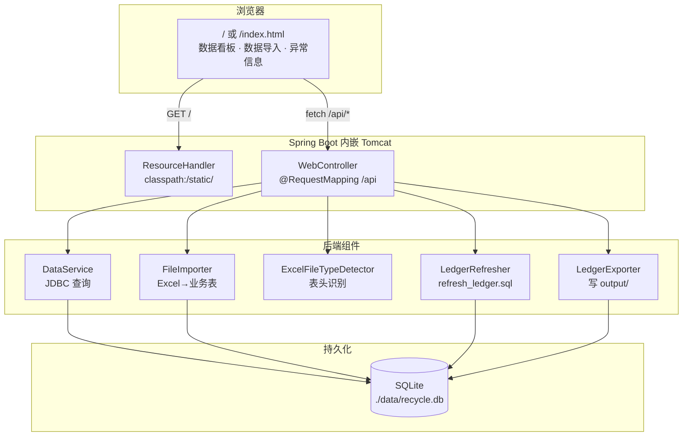
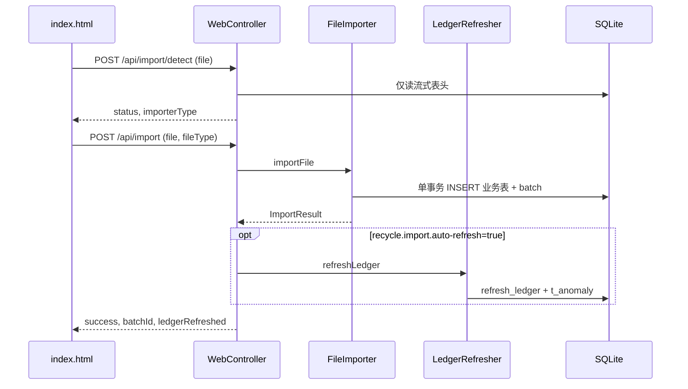

# 财务回收对账系统 技术设计方案

> **产品约束、字段级数据流与验收口径以 [PRD.md](./PRD.md) 为准。** 本文描述实现架构、模块职责、库表与 SQL 资源、API 及与代码路径的对应关系。若与 PRD 冲突，以 PRD 为验收标准。

---

## 0. 与 PRD 的章节映射

| PRD | 技术方案 |
|-----|----------|
| §1～§2 背景与场景 | 本文 §2 选型；交互见 `static/index.html`；**接口清单见 §1.2** |
| **§3.0 数据流动总览（字段级）** | **PRD 图示与字段表**；实现对应本文 §3、§6～§9 |
| §3.1～§3.6 数据字典 | 本文 §5；物理 DDL 以 `schema.sql` 为准 |
| §5.1 库生命周期 / 出库前置 | 本文 §6.3、`GET /api/import/baseline`（§1.2 序号 2） |
| §5.2 增量导入 | 本文 §6.4～§6.6 |
| §5.3 刷新总台账 | 本文 §7、`sql/refresh_ledger.sql` |
| §5.4 导出 | 本文 §9、`LedgerExporter` |
| §5.5～§5.9 看板、筛选与异常信息 | 本文 §1.2、§4、§10、`DataService` |
| §5.7 Web 导入与识别 | `ExcelFileTypeDetector`、`WebController`、`index.html`（§1.2 序号 3～4） |

---

## 1. 前后端架构大图与接口清单

### 1.1 架构总览（浏览器 ↔ 后端 ↔ 数据）

下列图为 **静态单页** `src/main/resources/static/index.html` 与 **Spring Boot**（默认端口 `8080`）之间的调用关系；**无独立前端工程**，页面通过 `fetch` 访问同源 `/api/**`。



### 1.2 前后端交互接口一览（REST）

**Base URL**：`http://localhost:8080`（可配置 `server.port`）。**JSON 接口**响应体普遍含 `success`；失败时含 `message`。**文件上传**为 `multipart/form-data`。

| # | 方法 | 路径 | 请求参数 / Body | 成功响应要点 | HTTP 错误码（常见） |
|---|------|------|-----------------|--------------|---------------------|
| 1 | `GET` | `/` | — | 返回 `index.html` 静态页 | — |
| 2 | `GET` | `/api/import/baseline` | 无 | `success`、`outboundRowCount`、`recycleReturnImportAllowed` | 500 |
| 3 | `POST` | `/api/import/detect` | `multipart` 字段名 **`file`**：单个 `.xlsx` | `success`、`fileName`、`status`（`MATCHED`/`UNKNOWN`）、`importerType`（如 `出库单`/`回收表`）、`displayLabel`、`message` | 400 未选文件；500 读表头失败 |
| 4 | `POST` | `/api/import` | `multipart`：**`file`**、**`fileType`**（`出库单`/`回收表`/`退货表`，兼容 `现场回收`/`统一回收`） | `success`、`message`、`batchId`、`totalRows`、`newRows`、`ledgerRefreshed`（是否已触发刷新） | 400 参数无效；409 幂等重复；400 校验/业务；500 |
| 5 | `GET` | `/api/ledger` | Query：**`page`**（默认 1）、**`pageSize`**（默认 50）；筛选（均可选，组合为 `LedgerFilter` → SQL `WHERE`）：**`serialNo`**、**`salesperson`**、**`customer`**（模糊匹配）、**`recycleDateStart`**、**`recycleDateEnd`**（回收日期闭区间，见 PRD §5.8） | `success`、`data`（`t_ledger` 宽表行）、`pagination` | 500 |
| 5b | `GET` | `/api/ledger/conditional-summary` | Query：与 **(5)** 相同的筛选参数（无分页） | `success`、`totalRows`、`unrecycledCount`、`recycleRate`（条件回收率，与 PRD §5.8 一致） | 500 |
| 6 | `POST` | `/api/ledger/refresh` | 无 Body | `success`、`message` | 500 |
| 7 | `GET` | `/api/statistics` | 无 | `success`、`statistics`（见下）、`distribution`（`recycle_status` 分布） | 500 |
| 8 | `GET` | `/api/export` | Query：与 **(5)** 相同的筛选参数；未传则导出全表 | **二进制流**：`Content-Disposition` 附件；`Content-Type` xlsx | 500 无响应体 JSON |
| 9 | `GET` | `/api/anomalies` | Query：**`page`**（默认 1）、**`pageSize`**（默认 50） | `success`、`data`（`t_anomaly` 行，宽表全列）、`pagination` | 500 |

**`GET /api/statistics` 中 `statistics` 对象字段（PRD §5.5 全局概览四项）**：`totalOutbound`、`recycled`、`unrecycled`、`recycleRate`。**`problemLedger` / `anomaly*` 等扩展字段已不在本接口返回**（异常明细见 **`GET /api/anomalies`** / 「异常信息」Tab）。

**配置**：`recycle.import.auto-refresh`（默认 `true`）— `POST /api/import` 成功后是否自动执行 `LedgerRefresher.refreshLedger()`（与响应中 `ledgerRefreshed` 一致）。

**前端调用位置（便于对照代码）**：`index.html` Tab 顺序为 **数据看板 → 数据导入 → 异常信息** — **数据看板**：全局概览 + **「总台账」**（`searchLedger` / `clearLedgerFilters` / `exportExcel`）；**数据导入**：`loadImportBaseline`、`detectImportItem`、`startImport`、`refreshLedger`；**异常信息**：`loadAnomalies` → **`GET /api/anomalies`**。

### 1.3 页面 Tab 与接口对应（速查）

| 页面区域 | 涉及的 `fetch` / 接口（§1.2 序号） |
|---------|-----------------------------------|
| **数据看板** Tab | `GET /api/statistics` (7)；**总台账**：`searchLedger` → (7)+(5b)+(5)；`GET /api/export` (8)；筛选 Query 与 (5)/(5b)/(8) 一致 |
| **数据导入** Tab | `GET /api/import/baseline` (2)；每文件 `POST /api/import/detect` (3)；`POST /api/import` (4)；`POST /api/ledger/refresh` (6) |
| **异常信息** Tab | `GET /api/anomalies` (9)，分页展示 `t_anomaly` 全列 |

### 1.4 交互时序（导入一条文件，示意）



---

## 2. 技术选型

| 模块 | 技术 | 说明 |
|------|------|------|
| 语言与版本 | Java 17+ | 与 Spring Boot 3 / SQLite JDBC 兼容 |
| Web | Spring Boot 3.x `spring-boot-starter-web` | 嵌入式 Tomcat，REST + 静态资源 |
| 数据库 | SQLite 3，单文件 `./data/recycle.db` | 80w+ 行量级可接受 |
| JDBC | sqlite-jdbc | |
| Excel | Apache POI `poi-ooxml` | 仅 `.xlsx` |
| 前端 | `classpath:/static/index.html` | 数据导入 / 数据看板 Tab |
| 构建 | Maven | |
| 入口 | `WebApplication`（Web）；`Main`（可选 CLI） | 默认 `http://localhost:8080` |
| 幂等 | SHA-256 文件内容 | `batch_key` |

---

## 3. 数据流与模块职责（对齐 PRD §3.0）

### 3.1 端到端链路（摘要）

1. **Excel 上传** → `POST /api/import/detect`：`ExcelUtil.readHeaders` + `ExcelFileTypeDetector.detect` → `file_type`：`出库单` / `回收表` / `退货表` / 无法识别。
2. **正式导入** → `POST /api/import` → `FileImporter.importFile`：单连接 **单事务**；校验表头、`requireOutboundBaselineIfNeeded`、幂等 `batch_key`、逐行清洗与 INSERT；写入 `t_import_batch` 与对应业务表（`t_outbound` / `t_recycle` / `t_return`）。
3. **回收表**：每行 `FileImporter.resolveRecycleSourceFromRow` 根据「回收方式」含「统一」/「现场」写入 `recycle_source`（与 PRD §5.7 一致）。
4. **刷新**（导入后可选自动 + 手动 `POST /api/ledger/refresh`）→ `LedgerRefresher`：执行 `sql/refresh_ledger.sql` 全量替换 `t_ledger`，再写入 `t_anomaly`（多来源、越界）；**不读 Excel**。
5. **查询 / 导出** → `DataService` 对 `t_ledger` **宽表全列** JSON；`LedgerExporter` 按 PRD 主序列 + 扩展列导出 xlsx。

**字段级 Excel→库表→`t_ledger` 对照表** 见 PRD §3.0.3～§3.0.5，本文不重复展开。

### 3.2 核心类与资源

| 组件 | 路径 | 职责 |
|------|------|------|
| `ExcelFileTypeDetector` | `util/ExcelFileTypeDetector.java` | 表头集合匹配；`validateHeadersForImport`；回收类识别为 **回收表** |
| `FileImporter` | `pipeline/FileImporter.java` | 单文件事务、幂等、出库前置、`insertOutbound` / `insertRecycle` / `insertReturn` |
| `DataCleaner` | `util/DataCleaner.java` | 日期规范化、序列号大写、回收类运单号合并 |
| `LedgerRefresher` | `pipeline/LedgerRefresher.java` | 加载 `sql/refresh_ledger.sql`；`DELETE t_anomaly` → 刷新 `t_ledger` → 插入异常；SQLite 失连重试 |
| `LedgerExporter` | `exporter/LedgerExporter.java` | 宽表导出列顺序、中文表头映射 |
| `LedgerFilter` | `web/LedgerFilter.java` | 总台账筛选：序列号/销售员/客户 `LIKE`、回收日期闭区间 → SQL `WHERE` |
| `DataService` | `web/DataService.java` | 分页 + `LedgerFilter` 查询、`getConditionalSummary`；`getAnomalies` / `getAnomalyCount`；统计 §10 |
| `WebController` | `web/WebController.java` | REST API |
| `DatabaseInitializer` | `db/DatabaseInitializer.java` | 执行 `schema.sql`；`ensureWideLedger` 窄表迁移 |
| `LedgerSchema` | `db/LedgerSchema.java` | 宽表 `CREATE TABLE` DDL 常量、`isWideLedger` |
| `SqlResource` | `util/SqlResource.java` | 加载 classpath SQL 文本 |
| `schema.sql` | `resources/schema.sql` | 全量建表与索引 |
| `refresh_ledger.sql` | `resources/sql/refresh_ledger.sql` | 刷新 `t_ledger` 的 `INSERT…SELECT` |

---

## 4. Web 服务与 API（补充说明）

- **端口**：默认 `8080`（`application.properties` 中 `server.port`）。
- **静态资源**：`GET /` → `classpath:/static/index.html`（非 `WebController` 映射，由 Spring 资源处理器提供）。
- **REST 路径、参数、响应字段的完整清单**：见 **§1.2 前后端交互接口一览**，与 `com.company.recycle.web.WebController` 源码一致。

**配置**：`recycle.import.auto-refresh`（默认 `true`）— `POST /api/import` 成功后是否自动 `LedgerRefresher.refreshLedger()`。

**SQLite 库文件被替换/删除**（PRD §5.1.1）：`ConnectionManager.isSqliteStaleFileError`、`reconnectAfterExternalDbChange`；`FileImporter` / `LedgerRefresher` 失败时重试一次。`DatabaseInitializer` 使用池连接后须 `returnConnection`，禁止 try-with-resources 关闭池连接。

---

## 5. 数据库设计

> **完整 DDL 以 `src/main/resources/schema.sql` 为准。** 日期业务字段存 `TEXT`，统一清洗为 `YYYY-MM-DD`（或含时间的字段按实现存库）。

### 5.1 业务明细表（与 Excel 列一一对应）

- **`t_outbound`**：销售出库 **13 列** + `batch_id` FK → `t_import_batch.id`。主键 `serial_no`。
- **`t_recycle`**：回收模板 **42 列** + `id` + `recycle_source` + `batch_id`。表头识别为 **回收表** 入库；`recycle_source ∈ {现场回收, 统一回收}`。
- **`t_return`**：退货 **15 列** + `id` + `batch_id`。

外键：`batch_id` → `t_import_batch(id)`（见 schema）。

### 5.2 `t_ledger`（物化宽表）

- **主键**：`serial_no`（与出库一致）。
- **出库域**：与 `t_outbound` 业务列同名，另加 **`outbound_batch_id`** 对应 `batch_id`。
- **回收域**：`rc_` + `t_recycle` 列名（如 `rc_id`、`rc_recycle_source`…）。
- **退货域**：`rt_` + `t_return` 列名。
- **系统列**：`recycle_status`、`recycle_source_file`、`recycle_date`、`actual_customer`、`updated_at`（聚合与 CASE 规则见 PRD §5.3 / §3.0.6）。

**多行折叠**：同一 `serial_no` 在 `t_recycle`/`t_return` 多行时，刷新 SQL 取 **`MAX(id)`** 对应行参与 JOIN。

**迁移**：旧库若为窄表，`DatabaseInitializer.ensureWideLedger` 检测无 `rc_id` 则 `DROP t_ledger` 并用 `LedgerSchema.CREATE_LEDGER_WIDE` 重建；用户需重新 **刷新总台账**。

### 5.3 `t_import_batch` / `t_anomaly`

见 PRD §3.0.2b、§3.6。`t_anomaly` 主要在 **刷新阶段** 写入；`batch_id` 实现可为 `NULL`。

### 5.4 索引

见 `schema.sql`：`t_outbound`/`t_recycle`/`t_return` 按 `serial_no` 等；`t_ledger` 上 `recycle_status`、`outbound_date`、`salesperson`、`end_customer` 等。

---

## 6. 导入管线实现

### 6.1 `file_type` 与目标表

| `file_type` | 目标表 | 说明 |
|-------------|--------|------|
| `出库单` | `t_outbound` | |
| `回收表` | `t_recycle` | 兼容旧 CLI：`现场回收`/`统一回收` 仍入 `t_recycle` |
| `退货表` | `t_return` | |

### 6.2 表头识别（`ExcelFileTypeDetector`）

判定顺序：**退货 → 出库 → 回收**（见 PRD §5.7）。回收类为 **42 列全集** 子集匹配，不要求列顺序。

### 6.3 出库前置（`FileImporter.requireOutboundBaselineIfNeeded`）

`COUNT(t_outbound)=0` 时仅允许 `出库单`；否则抛 `ImportValidationException`（文案见 PRD §6.1）。

### 6.4 事务与幂等

- `batch_key = displayFileName + "::" + SHA256(文件字节)`；已存在 → `DuplicateImportException`。
- 单文件：`setAutoCommit(false)` → 插入批次 → 逐行业务行 → `commit`；任一行失败 → `rollback`。
- 导入路径 **不写** `t_anomaly`。

### 6.5 回收来源解析（`FileImporter.resolveRecycleSourceFromRow`）

「回收方式」含「统一」→ `统一回收`；含「现场」→ `现场回收`；否则行级失败（整文件回滚）。

### 6.6 清洗（`DataCleaner.cleanRow`）

回收类：若「现场实际回收运单号」空则用「运单单号」填入；日期列集合见代码 `DATE_FIELDS`。

---

## 7. 总台账刷新（`t_ledger`）

**资源**：`src/main/resources/sql/refresh_ledger.sql`。

**结构概要**：

1. CTE **`recycle_latest`** / **`return_latest`**：`serial_no` 分组取 **`MAX(id)`** 行。
2. CTE **`all_sources`**：`t_recycle` ∪ `t_return`（退货行来源记为 **退货回收**）。
3. CTE **`source_count`**：按 `serial_no` 统计 `COUNT(DISTINCT source)`、`GROUP_CONCAT`、`MAX(recycle_date)`、`MAX(actual_customer)`。
4. **`INSERT OR REPLACE INTO t_ledger (...)`** `SELECT`：  
   `t_outbound o` **LEFT JOIN** `source_count` **LEFT JOIN** `recycle_latest rc` **LEFT JOIN** `return_latest rt`  
   写出出库列、`outbound_batch_id`、CASE 得到 `recycle_status`、聚合列、`updated_at`，以及全部 `rc_*`/`rt_*` 列。

**语义**：仅覆盖 **出库主链**上的序列号；越界序列号不入 `t_ledger`（见 §8）。

---

## 8. 刷新阶段写入 `t_anomaly`

在 `LedgerRefresher.refreshLedgerOnce` 中，**同一事务**内顺序：

1. `DELETE FROM t_anomaly`；
2. 执行 §7 的 `refresh_ledger.sql`；
3. **多来源冲突**：`INSERT INTO t_anomaly … SELECT` 来源种类数 ≥2 的 `serial_no`；
4. **回收越界**：`t_recycle` / `t_return` 中存在且 `t_outbound` 不存在的 `serial_no`。

SQL 文本见 `LedgerRefresher.java` 内嵌字符串（与 PRD §3.6 一致）。

---

## 9. 导出（`LedgerExporter`）

- **筛选**：`GET /api/export` 的 Query 与 `LedgerFilter` / `GET /api/ledger` 一致；无参数时导出全表，有参数时 `WHERE` 与列表相同。
- **数据源**：`SELECT` 宽表全部列，`ORDER BY` 与 PRD §5.4 排序一致（状态优先级 + 出库日期倒序）。
- **列顺序**：先 **PRD 主序列**（`EXPORT_PRIMARY_ORDER`：序列号…`updated_at`，含 `doc_type`、`description`、`outbound_batch_id`），再其余列按 `PRAGMA table_info` 剩余列名排序。
- **表头**：`HEADER_ZH` 映射已知列中文；扩展 `rc_*`/`rt_*` 未映射的用英文列名。
- **命名**：`NamingStrategy.resolveExportPath` → `./output/销售出库总台账_更新后.xlsx`，冲突追加 `(1)`、`(2)`…

---

## 10. 统计看板 SQL（对齐 PRD §5.5）

**全局概览四项** 实现见 `DataService.getStatistics()`：

- `totalOutbound`：`COUNT(*)` `t_outbound`
- `recycled` / `unrecycled`：`t_ledger` 上 `recycle_status` 过滤
- `recycleRate`：`t_ledger` 中三类已回收占比（与 PRD §5.5 一致）

**`distribution`**：`recycle_status` → 行数，供需要时使用。

**条件回收率（PRD §5.8）**：`DataService.getConditionalSummary(LedgerFilter)`，与总台账列表、`GET /api/export` 共用同一 `WHERE`。

**异常表列表（PRD §5.9）**：`DataService.getAnomalies` / `getAnomalyCount`，对应 **`GET /api/anomalies`**。

**口径**：台账业务状态与 `t_anomaly` 异常日志 **含义不同**；后者在 **「异常信息」** Tab 展示（PRD §5.9）。

---

## 11. 数据库初始化与版本

- `DatabaseInitializer.initialize()`：加载 `schema.sql`（按分号拆分执行，忽略 `--` 行注释）→ `ensureWideLedger`。
- `t_schema_version`：见 `schema.sql`；增量迁移策略可后续扩展 `CURRENT_VERSION`（当前以宽表检测为主）。

---

## 12. 项目目录结构（实现）

```
o-recycle-data-processer/
├── design/
│   ├── PRD.md
│   └── TECH_DESIGN.md
├── input/                          # 标准模板样例
├── data/recycle.db                 # 运行时
├── output/                         # 导出
├── src/main/java/com/company/recycle/
│   ├── Main.java
│   ├── web/              WebApplication, WebController, DataService
│   ├── db/               ConnectionManager, DatabaseInitializer, LedgerSchema
│   ├── pipeline/         FileImporter, LedgerRefresher
│   ├── exporter/         LedgerExporter
│   └── util/             ExcelUtil, ExcelFileTypeDetector, DataCleaner,
│                         FileHashUtil, DateParser, NamingStrategy, SqlResource
├── src/main/resources/
│   ├── schema.sql
│   ├── sql/refresh_ledger.sql
│   ├── application.properties
│   └── static/index.html
└── pom.xml
```

---

## 13. 依赖清单（摘录）

与根目录 `pom.xml` 一致，核心包括：`spring-boot-starter-web`、`sqlite-jdbc`、`poi`/`poi-ooxml`、`logback`、`slf4j`、`junit-jupiter`（test）。

打包主类可配置为 `com.company.recycle.web.WebApplication` 或 `com.company.recycle.Main`。
